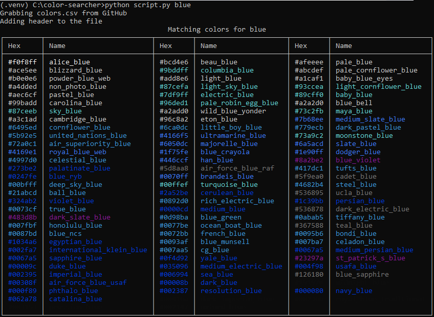
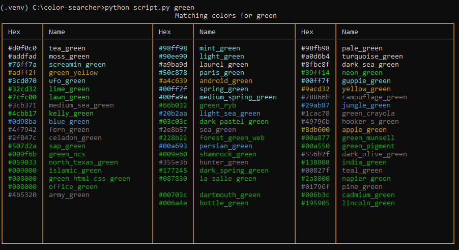

## Color Searcher / Pesquisador de cores
---> [Original git bbelderbos/color-searcher](https://github.com/bbelderbos/color-searcher) <---

Pequeno aplicativo de linha de comando para pesquisar código hexa das cores por nome.

```cmd

C:\color-searcher>python.exe -m venv .venv

C:\color-searcher>.venv\Scripts\activate

(.venv) C:\color-searcher>dir requir* /b
requirements.txt

(.venv) C:\color-searcher>pip install -r requirements.txt    

(.venv) C:\color-searcher>python.exe script.py lavender

```

Ele usa um csv com a lista de cores, no repositório GitHub que bifurquei e usando `rich` para exibir as cores correspondentes em uma tabela agradável, por exemplo.




